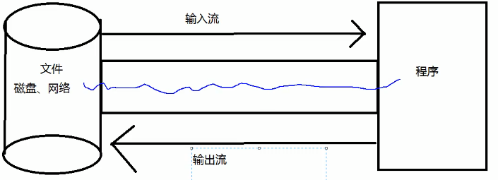
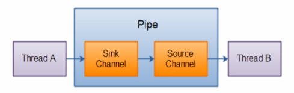

这个项目用来学习NIO
===
## NIO简介
		Java NIO(New IO / Non Blocking IO<非阻塞式IO>)是从Java1.4版本开始引入的一个新的IO API，可用代替
		标准的Java IO API；NIO与原来的IO同样的作用和目的，但是使用的方式完全不同，NIO支持面向缓冲区的、基于通道的IO操作。NIO将以更加高效的方式进行文件的读写操作；
## NIO和IO的主要区别
		| NIO | IO |
		| ------------- | ------------- |
		| 面向流(Stream Oriented)  | 面向缓冲区(Buffer Oriented)  |
		| 阻塞IO(Blocking IO) | 非阻塞IO(Non Blocking Oriented) |
		| 无 | 选择器(Selectors) |
*以上表的后两点是针对于网络编程而言*

*传统的IO*

可见：传统的IO流是单向的，是面向流的
*NIO*

可见：NIO是以管道为连接(不进行数据的交互)，缓冲区作为数据的存储来进行交互，因此NIO是面向缓冲区的
## 通道与缓冲区
	Java NIO系统的核心在于：通道(Channel)和缓冲区(Buffer)。通道表示打开到IO设备(如：文件、套接字)的连接。若需要使用NIO系统，需要获取用于连接IO设备的通道以及用于容纳数据的缓冲区。然后操作缓冲区，对数据进行处理；***总而言之，Channel负责传输，Buffer负责存储***
###  缓冲区
	缓冲区：一个用于特定基本数据类型的容器。由java.nio包定义的，所有缓冲区都是Buffer抽象类的子类；
	* Java NIO的Buffer主要用于与NIO通道进行交互，数据是从通道读入缓冲区，从缓冲区写入通道中的；
*缓冲区的图解：*
	

#### 直接与非直接缓冲区
	* 字节缓冲区要么是直接的，要么是非直接的。如果为直接缓冲区，则Java虚拟机会尽最大努力直接在此缓冲区上执行I/O操作。也就是说，在每次调用基础操作系统的一个本机I/O操作之前(或之后)，虚拟机都会尽量避免将缓冲区的内容复制到中间缓冲区中(或从中间缓冲区中复制内容)；
	* 直接字节缓冲区可以通过调用此类的allocateDirect()工厂方法来创建。此方法返回的==缓冲区进行分配和取消分配所需成本通常高于非直接缓冲区==。直接缓冲区的内容可以驻留在常规的垃圾回收堆之外，因此，它们对应用程序的内存需求量造成的影响可能并不明显。所以建议将直接缓冲区主要分配给那些易受基础系统的本机I/O操作影响的大型、持久的缓冲区。一般情况下，最好仅在直接缓冲区能在程序性能方面带来明显好处时分配它们；
	* 直接字节缓冲区还可以通过==FileChannel的map()方法==将文件区域映射到内存中来创建。该方法返回MappedByteBuffer。Java平台的实现有助于通过JNI从本机代码创建直接字节缓冲区。如果以上这些缓冲区中的某个缓冲区实例指的是不可访问的内存区域，则试图访问该区域不会更改该缓冲区的内容，并且将会在访问期间或稍后的某个时间导致抛出不确定的异常；
	* 字节缓冲区是直接缓冲区还是非直接缓冲区可通过调用其isDirect()方法来确定。提供此方法是为了能够在性能关键性代码中执行显示缓冲区管理；

*非直接缓冲区*
	
*直接缓冲区*
	
### 通道
	* 通道(Channel)：由java.nio.channels包定义的。Channel表示IO源头与目标打开的连接。Channel类似于传统的“流”。只不过Channel本身不能直接访问数据,Channel只能与Buffer进行交互；
*通道*
	
### 分散与聚集
	* 分散读取(Scattering Reads)：将通道中的数据分散到多个缓冲区中
	* 聚集写入(Gathering Writes)：将多个缓冲区中的数据聚集到通道中
	需要注意：无论是分散读取还是聚集写入，都是按照顺序的，如分散读取就是将Channel管道内的数据按照顺序依次填满Buffer缓冲区；聚集写入就是将每个Buffer按照填满的顺序写入Channel管道中；
*分散与聚集*
	
## 阻塞式和非阻塞式
*阻塞与非阻塞*
	* 传统的IO流都是阻塞式的，也就是说，当一个线程调用read()或write()时，该线程被阻塞，直到有一些数据被读取或写入，该线程在此期间不能执行其他任务。因此，在完成网络通信进行IO操作时，由于线程会阻塞，所以其他服务端必须为每个客户端都提供一个独立的线程进行处理，当服务端需要处理大量客户端时，性能急剧下降；
	* Java NIO是非阻塞式的，当线程从某通道进行读写数据时，若没有数据可用时，该线程可以进行其他任务。线程通常将非阻塞IO的空闲时间用于在其他通道上执行IO操作，所以单独的线程可以管理多个输入和输出通道。因此，NIO可以让服务器使用一个或有限几个线程来同时处理连接到服务端的所有客户端；
*传统IO在网络中的形式(阻塞式)*
	.PNG)
*NIO在网络中的形式(非阻塞式)*
	.PNG)
## 管道(Pipe)
Java NIO管道是2个线程之间的==单向==数据连接。管道(Pipe)有一个source通道和一个sink通道。数据会被写道sink通道，从source通道读取；
*管道*
	
